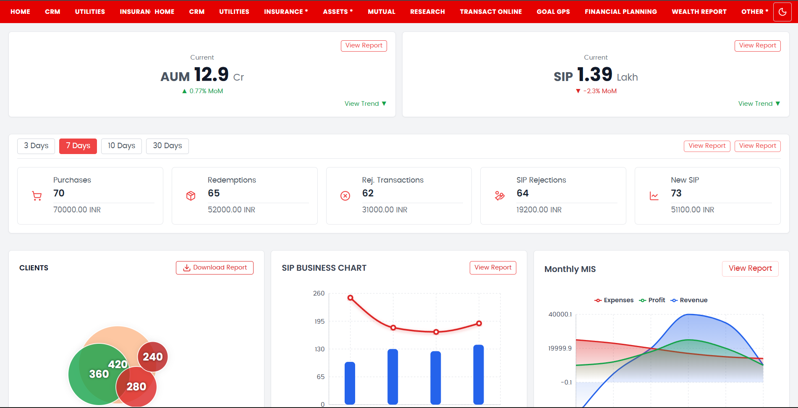
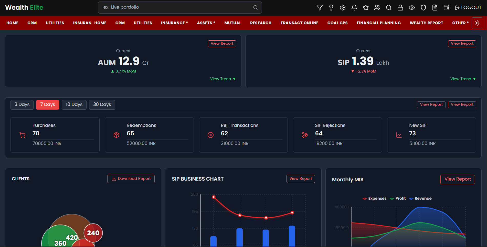

# 📊 Financial Dashboard

A responsive and modern financial dashboard built with **Next.js 14 App Router**, **Tailwind CSS**, and **Recharts**. This dashboard provides key insights such as AUM, SIP metrics, and interactive charts for client and business data.

### Light Mode Preview


### Dark Mode Preview

---

## 🚀 Live Demo

👉 [View Deployed Dashboard](https://financial-dashboard-zeta-ochre.vercel.app/)

---

## ✨ Features

- 🔹 Responsive layout (Mobile, Tablet, Desktop)
- 🔹 Light and Dark mode toggle
- 🔹 Real-time chart components using **Recharts**
- 🔹 AUM and SIP performance cards with MoM % change
- 🔹 Filter bar for time ranges: 3D, 7D, 10D, 30D
- 🔹 Client bubble chart and SIP line/bar combination
- 🔹 Monthly MIS multi-line performance chart
- 🔹 Mock API integration with dynamic updates
- 🔹 Download report & view report options

---

## 🧱 Tech Stack

- **Next.js 14** – App Router
- **Tailwind CSS 3**
- **React 18**
- **TypeScript**
- **Recharts**
- **Framer Motion** (optional animation usage)
- **Lucide React** (icons)

---

## 🛠️ Installation

> You’ll need **Node.js v18+** and **npm** or **yarn** installed.

```bash
# Clone the repository
git clone https://github.com/njg37/financial-dashboard.git
cd financial-dashboard

# Install dependencies
npm install
# or
yarn install
```

## 💻 Running Locally
```bash
# Start development server
npm run dev
Then open http://localhost:3000 in your browser.
```
## 🧪 Building for Production
```bash
npm run build
npm start
```

## Acknowledgements

Next.js

Tailwind CSS

Recharts

Lucide Icons

Recharts

Lucide Icons
